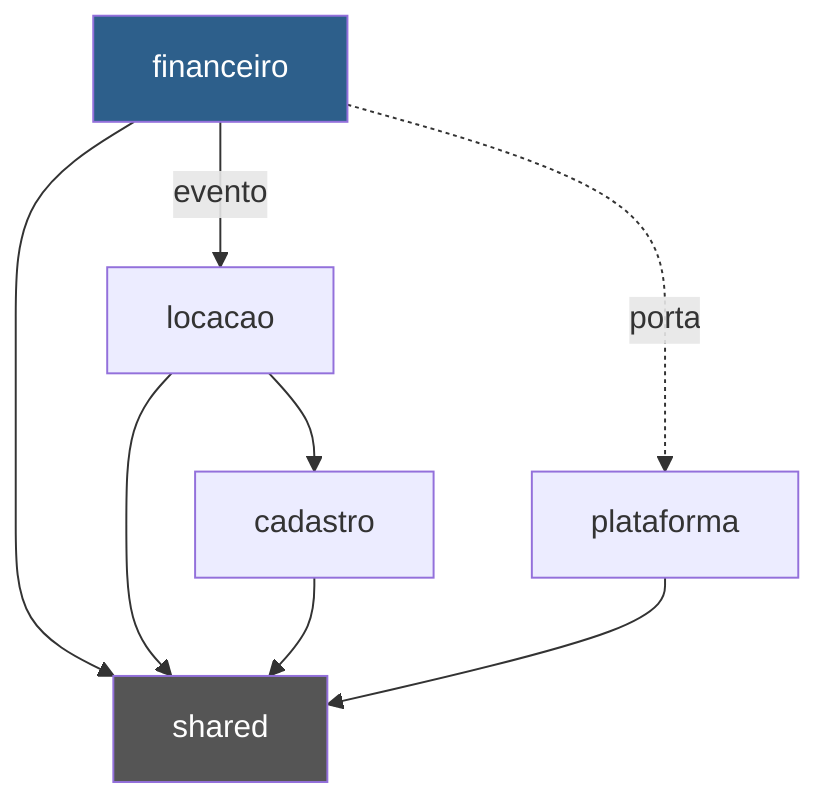
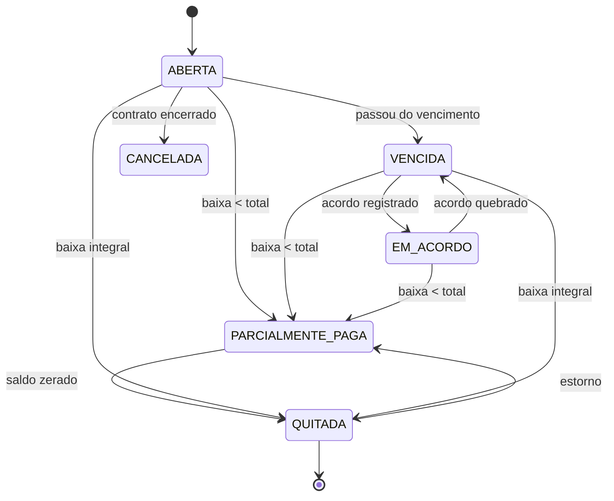
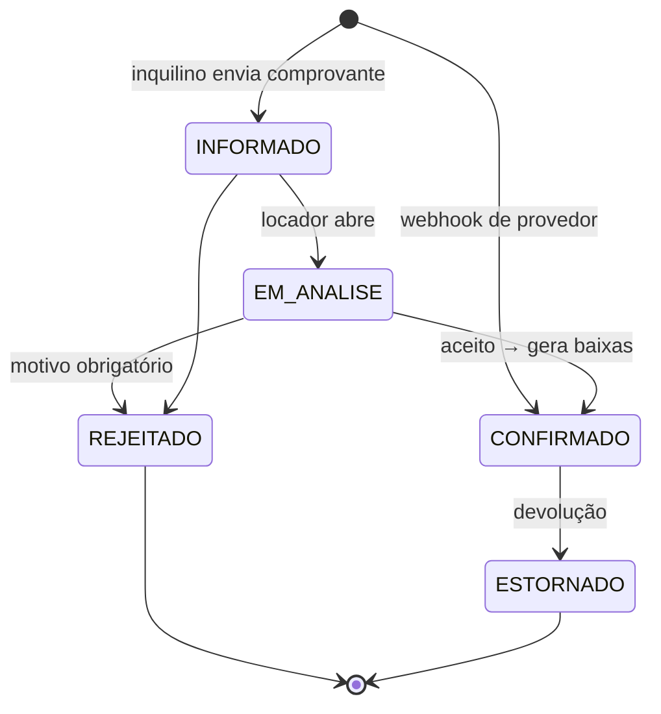
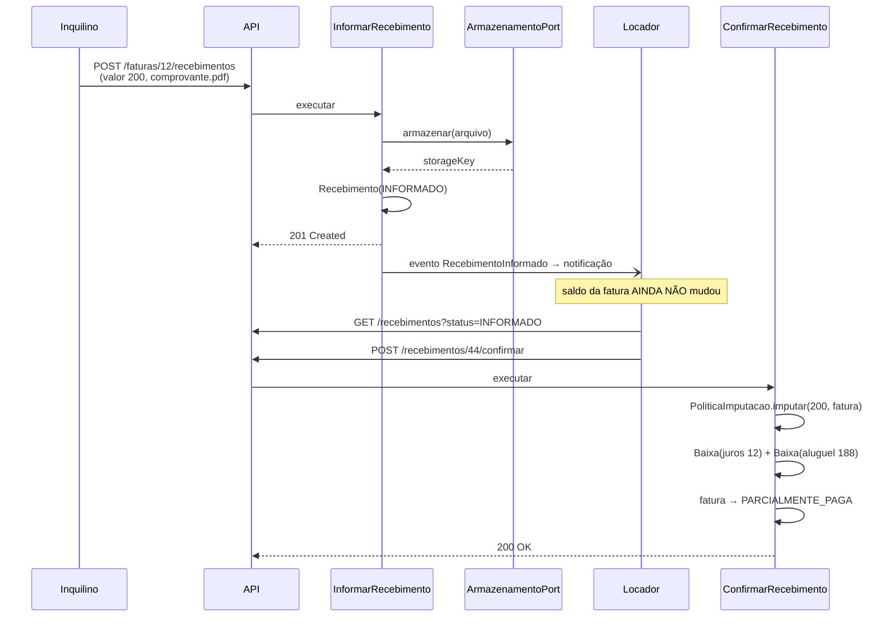

# Arquitetura — Imobly Gest API

> Documento de referência do desenho da aplicação.
> Versão 1.0 — 2026-08-05. Plano de execução em [PLANO-DE-ACAO.md](PLANO-DE-ACAO.md).

---

## 1. Contexto

O sistema gerencia a locação de um pequeno conjunto de imóveis próprios (hoje 3 casas),
administrados diretamente pelos proprietários — não é um produto de imobiliária.

A característica que define o domínio é **o pagamento fracionado e informal**:

> O inquilino deve R$ 1.200 do mês. Paga R$ 200 hoje, promete R$ 1.000 para depois.
> Na data prometida paga R$ 700. Dias depois paga os R$ 300 restantes.
> Enquanto isso, o aluguel permanece pendente.

Isso não é uma exceção a ser tratada com gambiarra: é o fluxo normal do negócio.
A arquitetura precisa representar de forma nativa:

- uma dívida mensal que é quitada por **N transações** de valores arbitrários;
- uma transação que pode abater **N dívidas** (quita o resto de julho e adianta agosto);
- a **promessa de pagamento** como fato registrável, com cumprimento verificável;
- a distinção entre "o inquilino disse que pagou" e "o locador conferiu e aceitou".

O primeiro canal de entrada de pagamento é o **informe manual com envio de comprovante**.
Integração com provedor de pagamento (Pix/API) é evolução prevista, não requisito inicial —
mas o desenho reserva o ponto de extensão desde já.

### 1.1 Restrições que moldam as decisões

| Restrição | Consequência de projeto |
|---|---|
| Volume baixíssimo (3 imóveis, dezenas de faturas/ano) | Saldos são **derivados por query**, não materializados. Performance não é critério de decisão. |
| Operado pela própria família, sem equipe de TI | Deploy único, sem orquestração. Simplicidade operacional acima de elegância. |
| Regras financeiras densas e propensas a erro | O módulo financeiro recebe modelagem rica; os demais permanecem CRUD. |
| Dinheiro real de terceiros em jogo | Trilha de auditoria imutável. Nenhum saldo é sobrescrito — tudo é lançamento. |

---

## 2. Decisões arquiteturais

### ADR-01 — Monolito modular por contexto de negócio

**Decisão:** aplicação única, dividida em módulos com fronteiras explícitas por contexto
(`cadastro`, `locacao`, `financeiro`, `plataforma`), e não por camada técnica global
(`controller/`, `service/`, `entity/` como hoje).

**Motivo:** microserviços aqui só adicionariam custo operacional — não há escala,
equipe ou requisito de deploy independente que os justifique. Mas a organização
por camada técnica atual não expressa o domínio: `PagamentoService` e `ImovelService`
são vizinhos no diretório e não têm nenhuma relação de negócio.
A modularização preserva a opção de extrair um serviço no futuro sem pagar por ela agora.

**Consequência:** o pacote de nível superior passa a nomear o contexto, não a camada.

### ADR-02 — Hexagonal apenas no módulo financeiro

**Decisão:** `financeiro` é estruturado em domínio / aplicação / adaptadores, com portas
para tudo que é externo. `cadastro` e `locacao` permanecem em estilo Spring convencional
(controller → service → repository).

**Motivo:** hexagonal paga o próprio custo quando existe (a) regra de negócio densa que
merece teste isolado e (b) integração externa substituível. Ambas valem para o financeiro:
a lógica de imputação, encargos e conciliação é o núcleo do produto, e o provedor de
pagamento vai mudar. Nada disso vale para o cadastro de endereços — aplicar a mesma
cerimônia lá seria burocracia sem retorno.

**Consequência:** convivem dois estilos no mesmo projeto, deliberadamente. A regra de
quando usar cada um está documentada aqui e deve ser respeitada.

### ADR-03 — Comunicação entre módulos por fachada e evento

**Decisão:** um módulo expõe **uma** classe pública (`*Facade`); todo o resto é
`package-private`. Nenhum módulo importa entidade JPA de outro — a travessia usa ID e DTO.
Efeitos colaterais entre contextos são publicados como eventos de domínio.

**Motivo:** hoje `ContratoService` chama `AluguelService.gerarAlugueis()` diretamente,
acoplando a abertura de contrato à geração de faturas dentro da mesma transação e do mesmo
raciocínio. Com evento, `locacao` publica `ContratoAssinado` e desconhece quem escuta.

**Consequência:** `ContratoService` não sabe que faturas existem. Testar a abertura de
contrato não exige o módulo financeiro no contexto.

### ADR-04 — Saldo é derivado, nunca escrito

**Decisão:** `fatura.valor_pago` deixa de ser fonte de verdade. O saldo é
`SUM(baixa.valor)` sobre baixas de recebimentos confirmados. A coluna permanece apenas
como cache recalculado na mesma transação que altera as baixas.

**Motivo:** o código atual faz `aluguel.setValorPago(valorPago.add(novo))`. Qualquer falha
parcial, retentativa ou correção manual dessincroniza o saldo permanentemente, sem
possibilidade de reconstrução. Com saldo derivado, o estado é sempre reconstruível a
partir dos lançamentos — que é como sistemas financeiros funcionam.

**Consequência:** estorno e correção viram operações triviais (remover/inverter lançamento),
não cirurgia em coluna.

### ADR-05 — Comprovante fora da linha da transação

**Decisão:** o arquivo sai de `pagamento.comprovante_bytea` para uma entidade `Arquivo`
com chave de storage, atrás da porta `ArmazenamentoArquivoPort`.

**Motivo:** `bytea` inline infla o dump do banco, é carregado em todo `SELECT` do agregado
e impede troca por storage externo sem migração de dados. O adaptador inicial grava em
disco local; a troca por S3/MinIO depois não toca o domínio.

### ADR-06 — Migração de schema versionada com Flyway

**Decisão:** adotar Flyway. O DDL em `scripts/initdb/` vira baseline `V1__baseline.sql`.

**Motivo:** as entidades JPA e o DDL já divergiram em pelo menos cinco pontos
(seção 9.1). Sem migração versionada não há como saber qual schema está em qual ambiente,
e a divergência tende a crescer.

---

## 3. Estrutura de módulos

```
com.mscosta.imobly
│
├── shared/                      Kernel compartilhado. Não depende de ninguém.
│   ├── domain/                  Dinheiro, Competencia, Periodo, DomainEvent
│   ├── exception/               BusinessException, NotFoundException, handler global
│   ├── audit/                   EntidadeAuditavel (@MappedSuperclass)
│   └── config/                  Swagger, Jackson, LoggerAspect
│
├── cadastro/                    Quem e o quê. Estilo CRUD.
│   ├── pessoa/                  Pessoa, EstadoCivil, contatos
│   ├── endereco/                Endereco (compartilhado por pessoa e imóvel)
│   ├── imovel/                  Imovel, dados registrais
│   └── CadastroFacade           ← única classe pública
│
├── locacao/                     O vínculo jurídico. Estilo CRUD + eventos.
│   ├── contrato/                Contrato, Garantia, Testemunha, reajuste
│   ├── vistoria/                Vistoria de entrada e saída
│   ├── event/                   ContratoAssinado, ContratoEncerrado, ContratoReajustado
│   └── LocacaoFacade            ← única classe pública
│
├── financeiro/                  O núcleo. Estilo hexagonal.
│   ├── domain/
│   │   ├── fatura/              Fatura, ItemFatura, TipoItem, StatusFatura
│   │   ├── recebimento/         Recebimento, StatusRecebimento, MetodoPagamento
│   │   ├── baixa/               Baixa
│   │   ├── acordo/              Acordo, StatusAcordo
│   │   └── policy/              PoliticaImputacao, CalculadoraEncargos
│   ├── application/
│   │   ├── usecase/             um caso de uso por classe (seção 6)
│   │   └── port/                ProvedorCobrancaPort, ArmazenamentoArquivoPort,
│   │                            NotificacaoPort
│   ├── adapter/
│   │   ├── in/rest/             FaturaController, RecebimentoController,
│   │   │                        AcordoController, WebhookController
│   │   ├── in/scheduler/        JobVencimentoDiario
│   │   ├── out/persistence/     repositórios JPA + mapeadores
│   │   └── out/gateway/         adaptadores de provedor de cobrança
│   └── FinanceiroFacade         ← única classe pública
│
└── plataforma/                  Capacidades transversais. Fase 2+.
    ├── arquivo/                 Arquivo, ArmazenamentoLocalAdapter, S3Adapter
    ├── auth/                    Usuario, Perfil, JWT
    ├── notificacao/             e-mail / WhatsApp
    └── relatorio/               extratos, inadimplência
```

### 3.1 Direção das dependências



Regras invioláveis:

1. `shared` não importa nada de módulo de negócio.
2. `cadastro` não conhece `locacao` nem `financeiro`.
3. `locacao` lê `cadastro` **pela fachada**, nunca pelo repositório.
4. `financeiro` reage a eventos de `locacao`; não chama `locacao` para escrever.
5. `plataforma` é alcançada apenas por porta, nunca por classe concreta.

Recomenda-se travar essas regras com ArchUnit (fase 1) — regra escrita que não é
verificada é regra que decai.

---

## 4. Modelo de domínio financeiro

Este é o coração do sistema e a parte que resolve o problema do pagamento fracionado.

```mermaid
erDiagram
    CONTRATO ||--o{ FATURA : "gera mensalmente"
    FATURA ||--|{ ITEM_FATURA : "compõe"
    FATURA ||--o{ BAIXA : "recebe"
    RECEBIMENTO ||--o{ BAIXA : "aloca"
    RECEBIMENTO ||--o| ARQUIVO : "comprova"
    FATURA ||--o{ ACORDO : "promete quitar"

    FATURA {
        bigint id
        int ano_referencia
        int mes_referencia
        date data_vencimento
        numeric valor_total
        numeric valor_pago "cache derivado"
        varchar status
    }
    ITEM_FATURA {
        bigint id
        varchar tipo "ALUGUEL|IPTU|MULTA|JUROS|DESCONTO"
        numeric valor
        int ordem_imputacao
    }
    RECEBIMENTO {
        bigint id
        numeric valor
        date data_pagamento
        varchar metodo
        varchar status
        varchar external_id "idempotência de gateway"
    }
    BAIXA {
        bigint id
        bigint id_fatura
        bigint id_recebimento
        bigint id_item_fatura
        numeric valor
    }
    ACORDO {
        bigint id
        numeric valor_prometido
        date data_prometida
        varchar status
    }
```



### 4.1 Fatura e ItemFatura

`Fatura` substitui a `Aluguel` atual — o nome muda porque a entidade deixa de representar
só o aluguel: ela é a **cobrança da competência**, e o aluguel é apenas um de seus itens.

Quando o pagamento atrasa e incidem multa e juros, esses valores precisam ser linhas
próprias, não um número somado no total. Sem itens não há como responder "dos R$ 1.320,
quanto é aluguel e quanto é encargo?" — nem aplicar imputação correta.

Cada item carrega `ordem_imputacao`, que determina o que é abatido primeiro (seção 4.5).

### 4.2 Recebimento

Substitui `Pagamento`. A mudança essencial é o **estado**: o registro passa a existir antes
de ser aceito.

Hoje, `PagamentoService.registrarPagamento()` credita o saldo no mesmo instante em que
recebe o request. Se o inquilino envia um comprovante ilegível, de valor divergente ou de
outra transação, o saldo já baixou. O locador precisa conferir **antes** de o dinheiro
contar.

`external_id` com índice único garante idempotência quando a origem for webhook de
provedor — reenvio é comportamento normal desses sistemas, não anomalia.

### 4.3 Baixa — a peça central

Tabela de ligação N:N entre `Recebimento` e `Fatura`, com valor próprio.

É o que destrava os dois cenários que o modelo atual não representa:

| Cenário | Baixas geradas |
|---|---|
| Paga 200, depois 700, depois 300 na fatura de julho | 3 baixas → mesma fatura |
| Paga 1.500 cobrindo o resto de julho e parte de agosto | 1 recebimento → 2 baixas, faturas distintas |
| Estorno de cheque devolvido | baixas invertidas, recebimento → `ESTORNADO` |

A baixa aponta opcionalmente para o `ItemFatura` abatido, permitindo saber que dos
R$ 200 pagos, R$ 20 foram para juros e R$ 180 para aluguel.

**Nenhuma baixa existe sem recebimento confirmado.** Essa é a invariante que sustenta a
derivação de saldo do ADR-04.

### 4.4 Acordo

Registra a promessa: "pago mil no dia 20". Hoje esse fato — que é o mecanismo real de
negociação da família — não existe no sistema; vive em conversa de WhatsApp.

Com ele registrado, a fatura entra em `EM_ACORDO` (não é inadimplência ativa enquanto a
promessa vale), o job diário verifica o vencimento da promessa, e o histórico de
`CUMPRIDO`/`QUEBRADO` por inquilino vira informação real para decisão de renovação.

### 4.5 Política de imputação

Quando entram R$ 200 numa fatura com juros de R$ 12, multa de R$ 120 e aluguel de R$ 1.200,
**o que é quitado primeiro?**

A resposta muda o saldo devedor e a base de cálculo dos encargos futuros. Precisa ser
decisão explícita, não consequência acidental da ordem de um `for`.

Duas políticas previstas:

- **`LEGAL`** — juros → multa → principal. É o que determina o Código Civil, art. 354.
- **`PRINCIPAL_PRIMEIRO`** — aluguel → multa → juros. Mais favorável ao inquilino:
  reduz a base sobre a qual novos juros incidem. Padrão sugerido para o contexto familiar.

A política é atributo do contrato, resolvida por `PoliticaImputacao` no domínio. Trocar
de política não altera lançamentos já feitos.

### 4.6 Invariantes do domínio

Regras que o modelo garante — a serem cobertas por teste unitário, não por confiança:

| # | Invariante |
|---|---|
| I1 | `SUM(baixa.valor)` de um recebimento ≤ `recebimento.valor` |
| I2 | `SUM(baixa.valor)` de uma fatura ≤ `fatura.valor_total` |
| I3 | Só recebimento `CONFIRMADO` possui baixas |
| I4 | `fatura.status = QUITADA` ⟺ saldo devedor == 0 |
| I5 | `baixa.valor > 0` (estorno é lançamento inverso, não valor negativo) |
| I6 | Uma fatura por `(contrato, ano, mês)` |
| I7 | Todo valor monetário é `BigDecimal` escala 2, `RoundingMode.HALF_UP` |

O excedente (recebimento maior que o total devido) não pode ficar órfão: ou é alocado a
fatura futura, ou o caso de uso rejeita. Crédito em conta fica para fase posterior.

---

## 5. Máquinas de estado

### Fatura



Os enums atuais (`A`, `R`, `P` como nome da constante) são substituídos por nomes legíveis.
A compatibilidade com o `CHAR(1)` do banco é mantida por `AttributeConverter`, não por
coincidência entre o nome da constante e o código persistido.

### Recebimento



`CONFIRMADO` é a única transição que gera baixas. `ESTORNADO` as inverte.

### Acordo

```
VIGENTE ──cumprido no prazo──> CUMPRIDO
        ──prazo expirado─────> QUEBRADO
        ──cancelado──────────> CANCELADO
```

---

## 6. Casos de uso

Um caso de uso por classe, em `financeiro/application/usecase/`.
O nome é uma ação de negócio no imperativo — não `FaturaService.processar()`.

| Caso de uso | Disparo | Efeito |
|---|---|---|
| `GerarFaturasDoContrato` | evento `ContratoAssinado` | cria faturas da vigência, usando `contrato.dia_vencimento` |
| `InformarRecebimento` | `POST /faturas/{id}/recebimentos` | cria `Recebimento(INFORMADO)` + `Arquivo`; **não** gera baixa |
| `ConfirmarRecebimento` | `POST /recebimentos/{id}/confirmar` | aplica imputação, gera baixas, recalcula fatura |
| `RejeitarRecebimento` | `POST /recebimentos/{id}/rejeitar` | exige motivo; nada é creditado |
| `EstornarRecebimento` | `POST /recebimentos/{id}/estornar` | inverte baixas, reabre fatura |
| `RegistrarAcordo` | `POST /faturas/{id}/acordos` | promessa de pagamento; fatura → `EM_ACORDO` |
| `AplicarEncargosDiarios` | `@Scheduled` diário | marca vencidas, cria itens de multa e juros, quebra acordos expirados |
| `ConsultarPosicaoFinanceira` | `GET /contratos/{id}/posicao` | saldo devedor, faturas em aberto, histórico |
| `ReceberNotificacaoProvedor` | `POST /webhooks/{provedor}` | idempotente por `external_id`; cria recebimento já confirmado |

---

## 7. Fluxo principal — informe de pagamento com comprovante



O ponto de projeto: **o mesmo caso de uso `ConfirmarRecebimento` é o destino tanto do
fluxo manual quanto do webhook de provedor**. A integração futura com Pix não introduz um
segundo caminho de crédito — apenas outra origem para o mesmo.

---

## 8. Portas e adaptadores

```java
public interface ArmazenamentoArquivoPort {
    ChaveArquivo armazenar(byte[] conteudo, String nomeOriginal, String mimeType);
    byte[] recuperar(ChaveArquivo chave);
    void remover(ChaveArquivo chave);
}

public interface ProvedorCobrancaPort {
    CobrancaGerada gerar(Fatura fatura);
    StatusCobranca consultar(String externalId);
    RecebimentoExterno interpretarWebhook(String payload, Map<String,String> headers);
}

public interface NotificacaoPort {
    void notificar(Destinatario destino, Mensagem mensagem);
}
```

| Porta | Adaptador fase 1 | Evolução |
|---|---|---|
| `ArmazenamentoArquivoPort` | filesystem local | S3 / MinIO |
| `ProvedorCobrancaPort` | — (não implementada) | Pix via API bancária |
| `NotificacaoPort` | log | e-mail, WhatsApp |

Sobre pagamento automatizado: antes de integrar API bancária, **Pix estático com chave
fixa + conciliação manual** resolve a maior parte da necessidade com uma fração do esforço
e sem homologação de provedor. A porta existe para quando isso deixar de bastar.

---

## 9. Modelo de dados

Tabelas mantidas: `endereco`, `pessoa`, `endereco_pessoa`, `imovel`, `contrato`,
`contrato_testemunha`, `vistoria`.

`aluguel` é renomeada para `fatura`; `pagamento` para `recebimento`. Tabelas novas:
`item_fatura`, `baixa`, `acordo`, `arquivo`.

```sql
CREATE TABLE imobly.item_fatura (
    id               BIGINT         NOT NULL DEFAULT nextval('imobly.seq_item_fatura_id'),
    id_fatura        BIGINT         NOT NULL,
    tipo             VARCHAR(20)    NOT NULL, -- ALUGUEL|IPTU|CONDOMINIO|MULTA|JUROS|DESCONTO
    descricao        VARCHAR(255)   NULL,
    valor            NUMERIC(10,2)  NOT NULL,
    ordem_imputacao  INT            NOT NULL DEFAULT 100,
    data_criacao     TIMESTAMP      NOT NULL DEFAULT CURRENT_TIMESTAMP,
    CONSTRAINT item_fatura_pk PRIMARY KEY (id),
    CONSTRAINT item_fatura_fatura_fk FOREIGN KEY (id_fatura) REFERENCES imobly.fatura (id),
    CONSTRAINT item_fatura_check_valor CHECK (valor <> 0)
);

CREATE TABLE imobly.baixa (
    id              BIGINT         NOT NULL DEFAULT nextval('imobly.seq_baixa_id'),
    id_recebimento  BIGINT         NOT NULL,
    id_fatura       BIGINT         NOT NULL,
    id_item_fatura  BIGINT         NULL,
    valor           NUMERIC(10,2)  NOT NULL,
    estorno_de      BIGINT         NULL,     -- aponta para a baixa invertida
    data_criacao    TIMESTAMP      NOT NULL DEFAULT CURRENT_TIMESTAMP,
    CONSTRAINT baixa_pk PRIMARY KEY (id),
    CONSTRAINT baixa_receb_fk FOREIGN KEY (id_recebimento) REFERENCES imobly.recebimento (id),
    CONSTRAINT baixa_fatura_fk FOREIGN KEY (id_fatura) REFERENCES imobly.fatura (id),
    CONSTRAINT baixa_item_fk   FOREIGN KEY (id_item_fatura) REFERENCES imobly.item_fatura (id),
    CONSTRAINT baixa_estorno_fk FOREIGN KEY (estorno_de) REFERENCES imobly.baixa (id),
    CONSTRAINT baixa_check_valor CHECK (valor > 0)
);
CREATE INDEX baixa_idx_fatura ON imobly.baixa (id_fatura);

CREATE TABLE imobly.acordo (
    id               BIGINT         NOT NULL DEFAULT nextval('imobly.seq_acordo_id'),
    id_fatura        BIGINT         NOT NULL,
    valor_prometido  NUMERIC(10,2)  NOT NULL,
    data_prometida   DATE           NOT NULL,
    status           VARCHAR(20)    NOT NULL DEFAULT 'VIGENTE',
    observacao       TEXT           NULL,
    data_criacao     TIMESTAMP      NOT NULL DEFAULT CURRENT_TIMESTAMP,
    data_modificacao TIMESTAMP      NULL,
    CONSTRAINT acordo_pk PRIMARY KEY (id),
    CONSTRAINT acordo_fatura_fk FOREIGN KEY (id_fatura) REFERENCES imobly.fatura (id),
    CONSTRAINT acordo_check_valor CHECK (valor_prometido > 0)
);

CREATE TABLE imobly.arquivo (
    id             BIGINT       NOT NULL DEFAULT nextval('imobly.seq_arquivo_id'),
    storage_key    VARCHAR(500) NOT NULL UNIQUE,
    nome_original  VARCHAR(255) NOT NULL,
    mime_type      VARCHAR(100) NOT NULL,
    tamanho_bytes  BIGINT       NOT NULL,
    hash_sha256    VARCHAR(64)  NOT NULL,
    data_criacao   TIMESTAMP    NOT NULL DEFAULT CURRENT_TIMESTAMP,
    CONSTRAINT arquivo_pk PRIMARY KEY (id)
);
```

Alterações em `recebimento` (ex-`pagamento`):

```sql
ALTER TABLE imobly.recebimento
    ADD COLUMN status       VARCHAR(20) NOT NULL DEFAULT 'INFORMADO',
    ADD COLUMN id_arquivo   BIGINT      NULL REFERENCES imobly.arquivo (id),
    ADD COLUMN external_id  VARCHAR(120) NULL,
    ADD COLUMN motivo_rejeicao TEXT     NULL,
    ADD COLUMN confirmado_por  BIGINT   NULL REFERENCES imobly.pessoa (id),
    ADD COLUMN data_confirmacao TIMESTAMP NULL,
    DROP COLUMN comprovante_bytea,
    DROP COLUMN id_aluguel;                  -- vínculo passa a ser via baixa

CREATE UNIQUE INDEX recebimento_uk_external ON imobly.recebimento (external_id)
    WHERE external_id IS NOT NULL;
```

Saldo devedor derivado:

```sql
CREATE VIEW imobly.vw_saldo_fatura AS
SELECT f.id,
       f.valor_total,
       COALESCE(SUM(b.valor), 0)              AS valor_pago,
       f.valor_total - COALESCE(SUM(b.valor), 0) AS saldo_devedor
FROM imobly.fatura f
LEFT JOIN imobly.baixa b ON b.id_fatura = f.id AND b.estorno_de IS NULL
LEFT JOIN imobly.recebimento r ON r.id = b.id_recebimento AND r.status = 'CONFIRMADO'
GROUP BY f.id, f.valor_total;
```

### 9.1 Divergências a corrigir antes de qualquer coisa

Estas quebram a aplicação hoje e são pré-requisito de todo o resto:

| Local | Problema |
|---|---|
| `Pagamento.java:35` | mapeia `comprovante_pagamento`; DDL tem `comprovante_bytea` |
| `Imovel.java:31` | mapeia `valor_aluguel`; DDL tem `valor_aluguel_sugerido` |
| `Pessoa.java:47` | `Set<Endereco>` sem `@ManyToMany` → falha no boot do Hibernate |
| `Pessoa.java:50` | campo `contato` não existe no DDL (que tem `email` + `telefone`) |
| `Contrato.java` | não mapeia `tipo_garantia` (`NOT NULL` no DDL) → todo insert falha |
| `Contrato.java:76` | `getId()` retorna `long` primitivo → NPE em entidade nova |
| `Contrato.java:6` | import não usado de `org.springframework.cglib.core.Local` |
| `AluguelService.java:52` | vencimento fixo no dia 10; ignora `contrato.dia_vencimento` |
| `Pagamento.java:26-28` | constantes de schema locais em vez de `DatabaseConstants` |
| enums | `A`/`R`/`P` como nome de constante; casam com o `CHAR(1)` por acidente |

---

## 10. Convenções técnicas

**Dinheiro.** `BigDecimal` sempre, escala 2, `RoundingMode.HALF_UP`. Nunca `double`.
Value object `Dinheiro` em `shared/domain` encapsulando as operações — soma de dinheiro
não deveria aceitar `BigDecimal` cru de qualquer origem.

**Transação.** Uma transação por caso de uso, aberta na camada de aplicação.
Nenhum `@Transactional` em controller ou repositório.

**Eventos.** `ApplicationEventPublisher` do Spring. Efeitos que devem compartilhar a
transação usam `@TransactionalEventListener(phase = BEFORE_COMMIT)`; notificações e
integrações usam `AFTER_COMMIT`.

**DTO.** `record` para request e response — o padrão já adotado em `PagamentoRequestDto`
e que deve substituir os DTOs de response com setter. Validação com Bean Validation
(ausente hoje: `PagamentoRequestDto` aceita valor nulo ou negativo sem reclamar).

**Erro.** `GlobalExceptionHandler` já existe e é o único responsável por traduzir exceção
em resposta HTTP. Exceções de domínio não carregam status HTTP.

**Auditoria.** `@MappedSuperclass EntidadeAuditavel` com `@CreatedDate`/`@LastModifiedDate`
via Spring Data Auditing, eliminando a repetição de `dataCriacao`/`dataModificacao` em
todas as entidades e os `setDataCriacao(LocalDateTime.now())` espalhados pelos services.

**Teste.** Domínio financeiro com teste unitário puro, sem Spring. Casos de uso com
Testcontainers. Cenários obrigatórios: as invariantes I1–I7 e os três cenários de baixa
da seção 4.3.

---

## 11. Fora de escopo

Registrado para evitar reabertura da discussão:

- **Microserviços** — sem justificativa de escala, equipe ou deploy.
- **CQRS/Event Sourcing** — a trilha de lançamentos já dá auditabilidade; ES traria
  complexidade sem retorno neste volume.
- **Multi-tenancy** — um único proprietário familiar. Se virar produto, revisitar.
- **Saldo credor do inquilino** — excedente é alocado a fatura futura ou rejeitado.
- **Emissão de boleto e NF** — só com demanda concreta.
