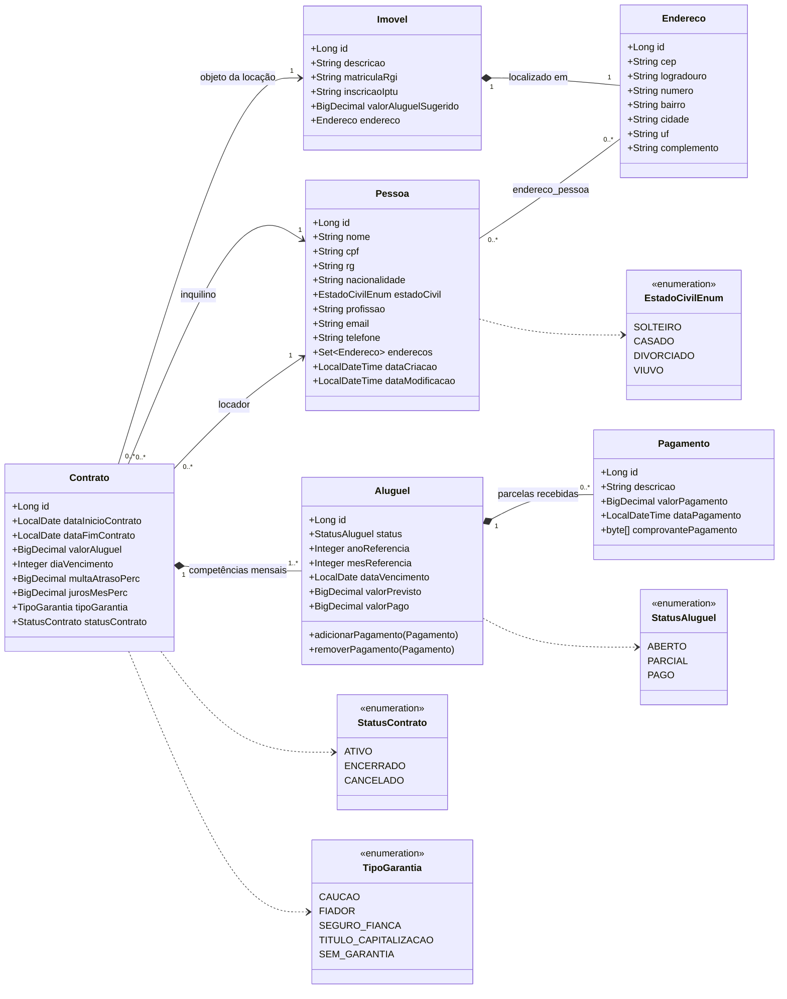
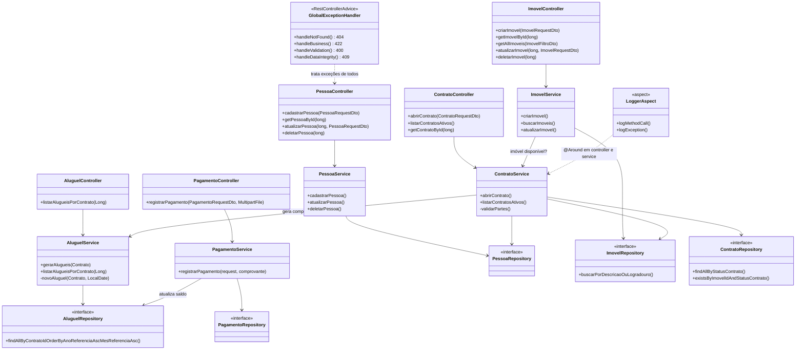
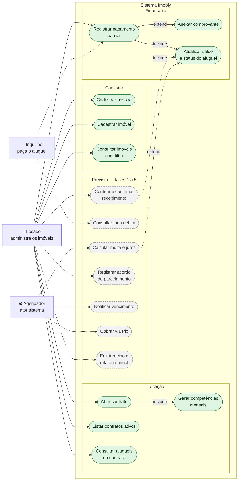
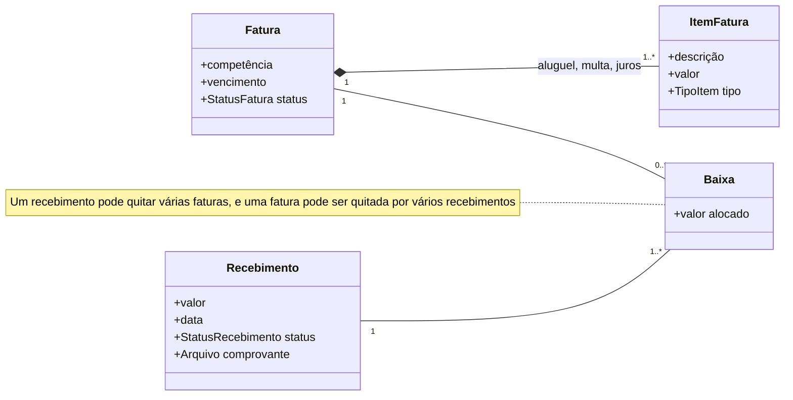

# Diagramas — Imobly Gest API

> Retrato do código **como ele está hoje**, ao final da [fase 0](PLANO-DE-ACAO.md#fase-0--fundação).
> O modelo-alvo (`Fatura`, `Recebimento`, `Baixa`) está em [ARQUITETURA.md](ARQUITETURA.md)
> e só entra na fase 1 — a seção 4 deste documento mostra a diferença.
>
> Versão 1.0 — 2026-08-06.

## Índice

1. [Diagrama de entidades (domínio persistido)](#1-diagrama-de-entidades)
2. [Diagrama de classes (camadas da aplicação)](#2-diagrama-de-classes)
3. [Diagrama de casos de uso](#3-diagrama-de-casos-de-uso)
4. [Para onde o modelo vai na fase 1](#4-para-onde-o-modelo-vai-na-fase-1)

---

## 1. Diagrama de entidades

As seis entidades JPA e os enums que as acompanham. Os enums de status são gravados
como `VARCHAR(1)` via `AttributeConverter`; `TipoGarantia` e `EstadoCivilEnum` são
gravados pelo nome da constante.

### Códigos gravados no banco

Os dois enums de status são persistidos como `VARCHAR(1)` por um `AttributeConverter`, então
o nome da constante em Java pode mudar sem migração de dados:

| Enum | Constante | Código no banco |
|---|---|---|
| `StatusAluguel` | `ABERTO` / `PARCIAL` / `PAGO` | `A` / `R` / `P` |
| `StatusContrato` | `ATIVO` / `ENCERRADO` / `CANCELADO` | `A` / `E` / `C` |
| `TipoGarantia` | `CAUCAO`, `FIADOR`, … | nome da constante (`VARCHAR(50)`) |
| `EstadoCivilEnum` | `SOLTEIRO`, `CASADO`, … | nome da constante (`VARCHAR(50)`) |

### O que ler nesse diagrama

- **`Pessoa` é papel, não tipo.** A mesma tabela serve locador e inquilino; quem define o
  papel é a ponta do `Contrato`. Por isso não existem entidades `Locador`/`Inquilino`.
- **`Aluguel` é uma competência mensal**, não um pagamento. Um contrato de 12 meses gera
  12 aluguéis na abertura, cada um com `anoReferencia`/`mesReferencia` e vencimento no
  `diaVencimento` do contrato.
- **`valorPago` é um cache**, mantido pelo `PagamentoService` a cada pagamento. O valor
  verdadeiro é a soma dos `Pagamento` — divergência entre os dois é bug silencioso, e é um
  dos motivos da reforma da fase 1.
- **`Pagamento` aponta para exatamente um `Aluguel`.** É aqui que o modelo atual trava: um
  pagamento de R$ 1.500 que quita dezembro e adianta janeiro não tem como ser representado.

---

## 2. Diagrama de classes

Camadas da aplicação. A direção das setas é a direção da dependência — nenhuma seta sobe.

**Onde as regras de negócio moram hoje:** nos services. `ContratoService.validarPartes()`
recusa imóvel já locado e locador igual ao inquilino; `AluguelService.novoAluguel()` decide
o vencimento; `PagamentoService.registrarPagamento()` decide o status do aluguel. A fase 1
move essas decisões para dentro das entidades.

---

## 3. Diagrama de casos de uso

Mermaid não tem notação UML de caso de uso, então os casos aparecem como elipses e os
atores como retângulos — a leitura é a mesma. **Linha cheia = implementado.
Linha tracejada = previsto no plano de ação.**

### Atores

| Ator | Quem é na prática | Acesso hoje |
|---|---|---|
| **Locador** | seus pais / você administrando | único usuário da API — sem autenticação ainda |
| **Inquilino** | quem aluga a casa | nenhum; informa o pagamento pelo WhatsApp e o locador registra |
| **Agendador** | rotina automática (`@Scheduled`) | não existe; entra na fase 2 |

### Casos de uso implementados

| # | Caso de uso | Endpoint | Regras já aplicadas |
|---|---|---|---|
| 1 | Cadastrar pessoa | `POST /api/v1/pessoa` | CPF e e-mail únicos e validados |
| 2 | Cadastrar imóvel | `POST /api/v1/imovel` | endereço obrigatório, CEP e UF validados |
| 3 | Consultar imóveis | `GET /api/v1/imovel` | filtro por descrição/logradouro, paginado |
| 4 | Abrir contrato | `POST /api/v1/contrato` | recusa imóvel já locado e locador = inquilino |
| 5 | Gerar competências | (interno, no `AluguelService`) | uma por mês da vigência, vencendo no `diaVencimento` |
| 6 | Listar contratos ativos | `GET /api/v1/contrato` | só `StatusContrato.ATIVO` |
| 7 | Consultar aluguéis | `GET /api/v1/aluguel/contrato/{id}` | ordenados por competência |
| 8 | Registrar pagamento | `POST /api/v1/pagamento` | multipart; valor mínimo 0,01; data não futura |
| 9 | Anexar comprovante | mesma chamada, parte `comprovante` | opcional (pagamento em dinheiro) |
| 10 | Atualizar saldo | (interno, no `PagamentoService`) | soma → `PARCIAL` ou `PAGO` |

**O fluxo que motivou o projeto** é a sequência 8 → 10 repetida: João deve R$ 1.200, paga
R$ 200 (`PARCIAL`), depois R$ 700 (`PARCIAL`), depois R$ 300 (`PAGO`). É exatamente o que o
`PagamentoFluxoTest` verifica.

---

## 4. Para onde o modelo vai na fase 1

O diagrama da seção 1 tem uma limitação estrutural: `Pagamento → Aluguel` é N:1, então um
pagamento pertence a um único mês. A fase 1 quebra essa amarra com uma tabela de alocação.

Duas mudanças de comportamento vêm junto:

1. **Saldo derivado.** O `valorPago` deixa de ser campo gravado e passa a ser a soma das
   baixas (`vw_saldo_fatura`) — acaba a possibilidade de o cache divergir.
2. **Recebimento tem estado.** Hoje, informar um pagamento já abate a dívida na hora, mesmo
   sem ninguém conferir o comprovante. Passa a existir `INFORMADO → CONFIRMADO`, e só o
   confirmado gera baixa. É o mesmo ponto onde o webhook do Pix vai desembocar na fase 4.

Detalhamento completo — DDL, máquinas de estado e política de imputação — na seção 6 do
[ARQUITETURA.md](ARQUITETURA.md).
